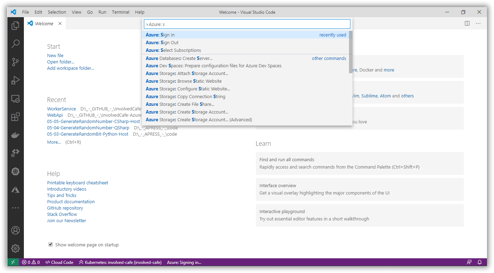
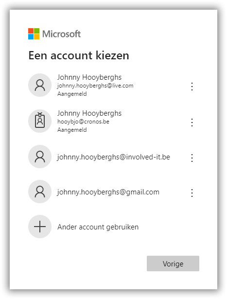
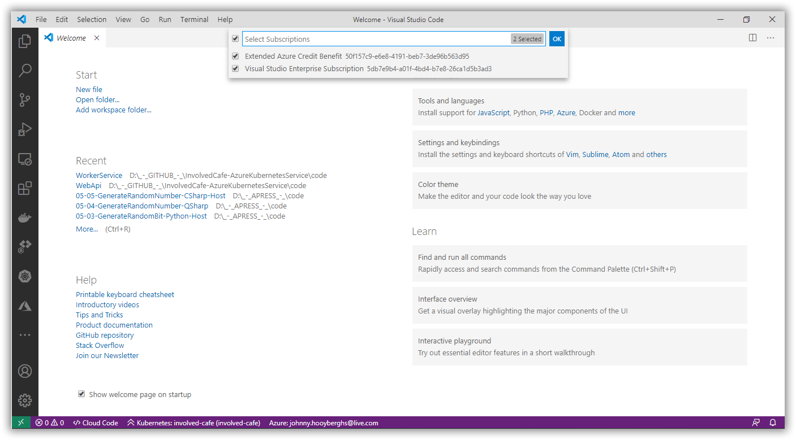

# CloudNativeApplicationsHandsOn-DevDaysEurope-2022

[Previous step](../../README.md) - [Next step](../step-02/README.md)

## Step 1 - Connect Visual Studio Code to your Azure Subscription

### Login to the Azure CLI

Open a terminal window, for example inside Visual Studio Code and use the following command to login to Azure:

```
az login
```

If you have multiple subscriptions with your Azure account use the following command to list all your subscriptions:

```
az account list -o table
```

Find the correct SubscriptionId and activate it using the following command:

```
az account set -s <SubscriptionId>
```

### Login to Azure in Visual Studio Code

From Visual Studio, use the Ctrl+Shift+P keyboard shortcut to open the Command Palette and find Azure: Sign In to link your Visual Studio code instance with your azure login:



Your browser will open and you need to login using the Microsoft account linked to your Azure subscription:



If your login was successful, you should be presented with a success screen:


Use the Command Palette in Visual Studio once more to select the active subscription:


Inside the Visual Studio Code IDE, you can have multiple subscriptions active. Use the checkboxes to make your selections:



[Previous step](../../README.md) - [Next step](../step-02/README.md)